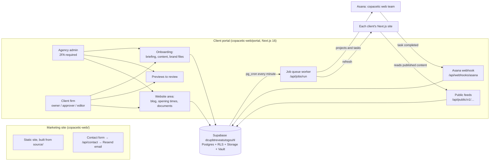

# copacetic.web: where we are (handover notes)

Last updated: 26 September 2026. Branch: `claude/copacetic-web-l19v4c` in `boylesa101/pineapple`, PR #3.

## How it fits together

## Built and pushed

| Area | What it does |
|---|---|
| Marketing site | Faithful port, mobile fixes, SEO, FAQs, the "Starting a law firm" guide and "Our philosophy". Also a new **Your client portal** section on the home page, a **[Number of pages to confirm]** placeholder and "Client portal and website editor" in each pricing tier, and a **Changes after sign-off** note. |
| Portal, Phase 1 | Invitations, roles, agency 2FA, stages, previews, audit log. |
| Portal, Phase 2 | Briefing (now including "What do you like about your current site?" and "What don't you like, or want to see changed?"), content sections with autosave, and uploads that are checked before they're accepted. Also agency review, print view and a zip download. |
| Portal, Phase 3 | Asana sync in both directions: a project for each client, tasks for submissions, and completing a task in Asana approves the item in the portal. Failed syncs retry and show on a Sync problems page. |
| Portal, Phase 4 | A client Website area: blog (owners and approvers publish or schedule), opening times (weekly hours plus bank holidays and closures), and documents (editors prepare them, owners and approvers show them). Also public feeds for client sites, automatic site refresh, and `portal/docs/CLIENT_SITE_STARTER.md`. |
| Reviews | Bug hunt and security review done; all findings fixed except two minor edge cases. |

Tests passing:
- Database: permissions 53, onboarding 35, Asana 22, website 38
- Unit tests: 49
- Production build: clean

## To pick up tomorrow

### Decisions for Andrew
1. **Pages per package** for Essential, Professional and Bespoke. They replace `[Number of pages to confirm]` on the Pricing page, set in `source/pages-5.js`.
2. **Team updates after launch.** The website says clients can update their team, but the portal can't do this yet. Clients can add team profiles during onboarding, but not after launch. Should we build it? The suggestion is to do it the same way as the blog: anyone edits, owners and approvers publish.
3. **Prices, and "[Who this is for]"** on each package, when ready.

### Vercel (from Andrew's laptop)
The Vercel connector here can create projects but gets "You don't have permission" when deploying, so these steps need doing by hand.
1. **Portal project.** `copacetic-web-portal` exists. In Settings → Git, connect `boylesa101/pineapple` and set the root directory to `copacetic-web/portal`.
2. **Portal environment variables.**
   - Copy them from `portal/.env.example`.
   - Add `SUPABASE_SECRET_KEY` and `JOBS_SECRET` (the value from `jobs_secret.txt`, already in Supabase Vault).
   - Add `ASANA_TOKEN` when it's ready.
   - Add `RESEND_API_KEY`, `EMAIL_FROM`, `AGENCY_NOTIFY_EMAIL` and `MEDIA_SIGNING_SECRET`.
3. **Deploy.** Deploy the `claude/copacetic-web-l19v4c` branch, or merge PR #3 first.
4. **Marketing site.** Deploy it the same way with root `copacetic-web`, and add `RESEND_API_KEY` and `CONTACT_FROM` for the contact form.
5. **Send Claude the live addresses.** Then Claude will:
   - add Vault `jobs_url` (`https://<portal>/api/jobs/run`)
   - add Supabase sign-in redirect URLs
   - make Andrew an agency admin (needs his login email)
   - create Vault `media_signing_secret`
   - check that everything responds

### Still needed from Andrew
- An Asana personal access token, ideally from a dedicated "portal" account in the copacetic web team.
- The Supabase secret key.
- A Resend account and a verified sending domain.
- A domain decision for the portal and the marketing site.
- The `Boylesa101/copacetic-web` GitHub repo, if we're moving the code out of `pineapple`.

## Useful facts
- **Supabase project:** `dcupbtreveatutogouhl`, in London.
- **Asana:**
  - workspace `1169581892431343`
  - team "copacetic web team" `1169581892702821`
  - Andrew's user id `1169581891186906`
- **Vercel:**
  - team "Andrew Boyles' projects" `team_wrXgJU6qXAIJoebcfYLjdNvz`
  - the new portal project `copacetic-web-portal`
  - "copacetic" is the separate copacetic.legal app; don't touch it
- **Build spec:** `docs/PORTAL_SPEC.md`. Portal setup is in `portal/README.md`.
